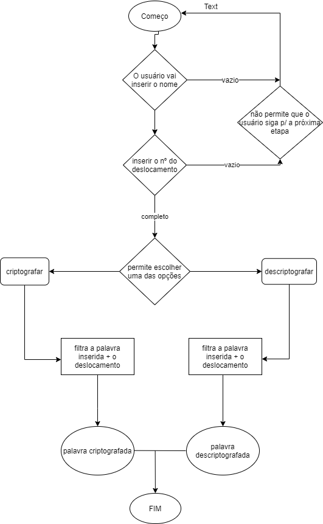

# Cifra de César
## 1. Prefácio
    Cifrar significa codificar.
    A cifra de César é uma das técnicas mais simples de cifrar uma mensagem. É um
    tipo de cifra por substituição, em que cada letra do texto original é
    substituida por outra que se encontra há um número fixo de posições
    (chave de deslocamento) mpara a frente do mesmo alfabeto.
## 2. Interface
    O produto permite que o usuário intercepte uma palavara que só ele e quem possuir a chave de deslocamento saberá qual é, tornandoa-a sigilosa. A interface fornece uma visualização clara e objetiva de como preencher cada campo requerido caso queira codificar ou decodificar uma palavra.
## 2.1 Getting Started
    Para utilizar o produto, o usuário precisa preencher a primeira lacuna com o texto que pretende decifrar ou cifrar, a segunda lacula com o a chave de deslocamento (nº) e por último deve-se clicar em uma das opções ao final do container, assim o mesmo devolverá o resultado esperado. Caso contrário, se nenhum campo for preenchido, o programa não permite que o usuário continue a ação.

## 3. Processo

## 3.1 Desenvolvimento 
    Para que o programa funcionasse foram criadas duas funções principais:
    * encode() esta função terá dois parâmetros: 
        - string: o texto que o usuário deseja cifrar
        - offset: a chave de deslocamento, que seria o nº de posições movidas para a direita no alfabeto
    * decode() esta função terá dois parâmetros: 
        - string: o texto que o usuário deseja decifrar
        - offset: a chave de deslocamento, que seria o nº de posições movidas para a esquerda no alfabeto
